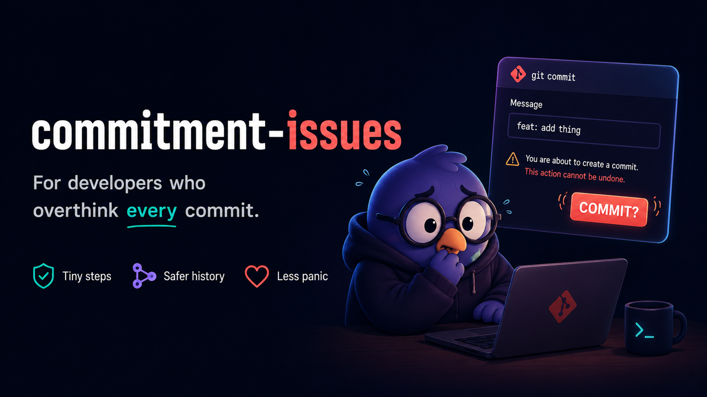
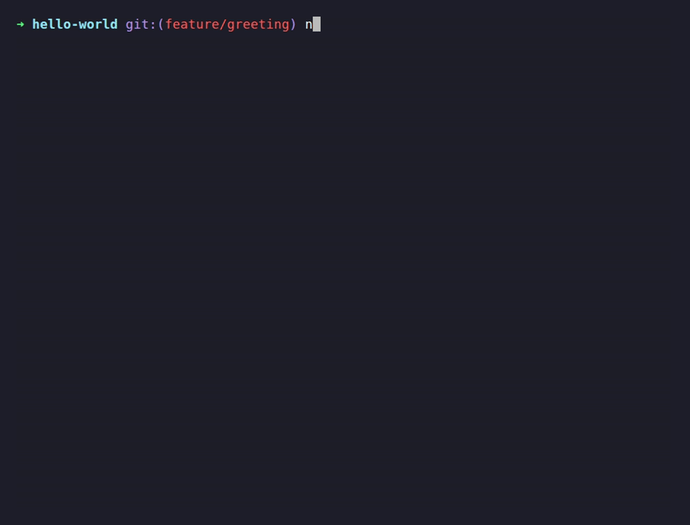
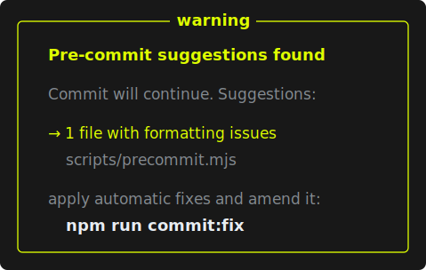
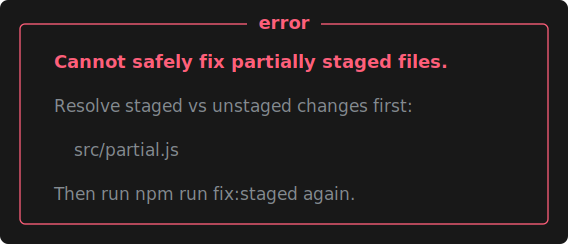
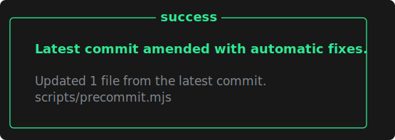
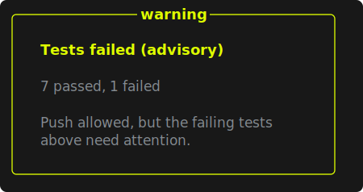
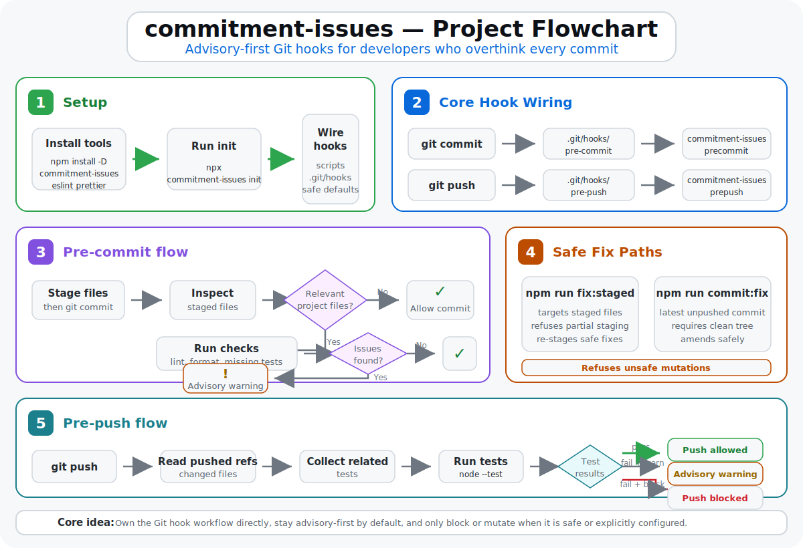

<p align="center">
  
</p>

# Commitment Issues

[](https://www.npmjs.com/package/commitment-issues)
[](https://www.npmjs.com/package/commitment-issues)
[](https://github.com/RoryGlenn/commitment-issues/actions/workflows/ci.yml)
[](docs/branch-coverage.md)
[](https://nodejs.org/)
[](LICENSE)

**Advisory-first Git guardrails for JavaScript and TypeScript projects.** Catch lint, formatting, missing-test, secret, branch, commit-shape, optional commit-message, and related-test problems before commits and pushes—without blocking or rewriting work unless you opt in.

No separate hook manager · No telemetry · npm, pnpm, Yarn, and Bun

[See it in action](#see-it-in-action) · [Quickstart](#quickstart) · [Why it is different](#why-it-is-different) · [Migration guide](docs/migration.md) · [Configuration](docs/configuration.md) · [Uninstall](#uninstall)

## See it in action

<p align="center">
  
</p>

**Commit normally → follow the suggested fix → push with related tests.** The output explains what happened, whether Git continued, and which follow-up is safe.

<details>
<summary>See common output states</summary>

### Pre-commit suggestions

<p>
  
</p>

### Safety refusal

<p>
  
</p>

### Safe automatic amend

<p>
  
</p>

### Advisory push failure

<p>
  
</p>

See [Message states](docs/message-states.md) for the complete gallery.

</details>

## Quickstart

You need **Node.js >=22.22.1**, Git, ESLint 9+ with a flat config, and Prettier 3+.

### 1. Install

```bash
npm install -D commitment-issues eslint prettier
```

`commitment-issues` also supports pnpm, Yarn, and Bun and adjusts its command hints to the package manager it detects.

Hooks resolve ESLint and Prettier only from the project's installed
`node_modules`. If either peer tool is missing, the check stays advisory and
prints the matching npm, pnpm, Yarn, or Bun install command; it never falls back
to `npx` to query a registry or install a package.

### 2. Preview and initialize

See exactly what setup would change:

```bash
npx commitment-issues init --dry-run
```

Then initialize:

```bash
npx commitment-issues init
```

`init` writes plain native Git hooks, adds helper scripts, and enables advisory push tests. It is idempotent and safe to re-run. See [What `init` changes](#what-init-changes) for the exact ownership boundaries.

### 3. Commit and push normally

```bash
git add -A
git commit -m "your message"
git push
```

Commit and push checks start in advisory mode. They report issues and suggest the next safe command while allowing the operation to continue.

If the tool suggests fixing the latest clean, unpushed commit, run:

```bash
npm run commit:fix
```

To fix the currently staged files before committing, run:

```bash
npm run fix:staged
```

## Why it is different

- **Low-risk adoption:** warnings first; enforcement only when your repository enables it.
- **Safe fixes:** automatic fix commands refuse ambiguous partial-staging and dirty-worktree states.
- **Useful push checks:** runs tests related to the files being pushed instead of the entire suite.
- **Native hook ownership:** no Husky, lint-staged, or separate hook-manager dependency.
- **Self-repair:** `doctor` recreates missing generated hooks after a fresh clone or install.
- **Local by design:** no account, telemetry, phone-home request, or repository upload.
- **Reversible:** preview setup and removal with `--dry-run`, then uninstall generated wiring with one command.

## What it catches

| Check                                  | Default result                        | Optional enforcement           |
| -------------------------------------- | ------------------------------------- | ------------------------------ |
| Lint and formatting drift              | Reports issues and safe fix paths     | Fix commands remain explicit   |
| Missing nearby tests                   | Warns and supports path exemptions    | —                              |
| Related staged tests                   | Off until `runStagedTests` is enabled | —                              |
| Related pushed-file tests              | Advisory after `init`                 | `blockPushOnTestFailure`       |
| Protected branches                     | Warns on direct commits and pushes    | `blockProtectedBranches`       |
| Likely staged secrets and dotenv files | Warns with file and line detail       | `blockOnSecrets`               |
| Branch behind its upstream             | Suggests pulling or rebasing          | —                              |
| Oversized commits and large files      | Suggests splitting or Git LFS         | —                              |
| Generated files and dependency folders | Warns before they land                | —                              |
| Commit messages through commitlint     | Off until explicitly enabled          | `commitMessage.blockOnFailure` |
| Broken generated hook wiring           | `doctor` reports and repairs it       | —                              |

Missing-test and pushed-test discovery use nearby filename conventions. See [Configuration and behavior](docs/configuration.md) for the matching rules, exemptions, supported test commands, and every guard option.

## How it works

<picture>
  <source media="(prefers-color-scheme: dark)" srcset="assets/project-flowchart-dark.svg">
  <source media="(prefers-color-scheme: light)" srcset="assets/project-flowchart-light.svg">
  
</picture>

`commitment-issues` writes native `.git/hooks/pre-commit` and `.git/hooks/pre-push` files. When commit-message linting is enabled, it also owns `.git/hooks/commit-msg`. Those hooks invoke the installed binary from `node_modules/.bin`; package source is not copied into your repository.

See [How commitment-issues works](docs/how-it-works.md) for the complete flow.

## Does it fit your project?

| Requirement or boundary | Support                                                              |
| ----------------------- | -------------------------------------------------------------------- |
| Primary ecosystem       | JavaScript and TypeScript projects                                   |
| Runtime                 | Node.js >=22.22.1                                                    |
| Linting and formatting  | ESLint >=9 flat config and Prettier >=3                              |
| Package managers        | npm, pnpm, Yarn, and Bun                                             |
| Git hooks               | Native `.git/hooks` files                                            |
| Yarn Berry              | Supported with `nodeLinker: node-modules`                            |
| Yarn Plug'n'Play        | Not supported; hooks resolve `node_modules/.bin`                     |
| Monorepos               | Root-level workspaces supported; review the documented boundaries    |
| Existing custom hooks   | Preserved; add the `commitment-issues` command manually              |
| Commit-message linting  | Optional; bring your own local commitlint CLI and configuration      |
| CI                      | Keep CI as the authoritative gate; local hooks can be disabled in CI |

This project is a strong fit when you want opinionated JS/TS commit guardrails with a gentle rollout. A general-purpose hook runner may fit better when your repository primarily needs arbitrary cross-language hook orchestration.

Popular setup paths:

- [Next.js, Vite, and TypeScript libraries](docs/framework-recipes.md)
- [Monorepos and workspaces](docs/monorepo.md)
- [Yarn Berry](docs/yarn-berry.md)
- [GitHub Actions, GitLab CI, and CircleCI](docs/ci-recipes.md)

## How it compares

| Capability                      | commitment-issues               | Husky + lint-staged                                         | Lefthook                            | pre-commit                       |
| ------------------------------- | ------------------------------- | ----------------------------------------------------------- | ----------------------------------- | -------------------------------- |
| Setup model                     | One `init` command              | Combine and configure two tools                             | Install binary and config           | Install app and config           |
| Default posture                 | Advisory-first                  | Defined by your scripts                                     | Commands normally control hook exit | Hooks normally control hook exit |
| Separate hook manager           | No                              | Husky                                                       | Lefthook binary                     | pre-commit runtime               |
| Staged ESLint/Prettier fixes    | Built in                        | Built into lint-staged tasks                                | Configure commands                  | Configure hooks                  |
| Partially staged files          | Refuses the fix                 | Temporarily hides and reapplies unstaged changes by default | Command-dependent                   | Hook-dependent                   |
| Related pushed-file tests       | Built in                        | Custom wiring                                               | Custom wiring                       | Custom wiring                    |
| Commit-message linting          | Optional commitlint integration | Custom wiring                                               | Custom wiring                       | Custom wiring                    |
| Safe latest-commit amend helper | Built in                        | Custom wiring                                               | Custom wiring                       | Custom wiring                    |
| Repair missing generated hooks  | `doctor`                        | Reinstall or custom repair                                  | Reinstall                           | Reinstall                        |
| Primary audience                | JS/TS projects                  | JS/TS projects                                              | Cross-language repositories         | Cross-language repositories      |

Already using another tool? Follow the step-by-step [migration guide](docs/migration.md) for Husky + lint-staged, Lefthook, or pre-commit. You do not need to reverse-engineer your current setup first.

## Adopt it with a team

1. Run `npx commitment-issues init --dry-run` and review the proposed ownership.
2. Run `npx commitment-issues init` and inspect the resulting `package.json` and `.gitignore` diff.
3. Commit `package.json`, your lockfile, and any accepted `.gitignore` additions. The `.git/hooks` files are intentionally local and are not committed.
4. Let the repository run in advisory mode first. Teammates can learn the messages without having commits or pushes unexpectedly blocked.
5. Once the warnings are trusted, enable only the enforcement modes the team wants.

When `prepare` is available, `init` sets it to `commitment-issues doctor --quiet`. If the project already owns `prepare`, init preserves that command and appends the repair command with `&&`. A normal package install then runs project setup followed by fresh-clone hook repair across npm, pnpm, Yarn, and Bun.

Existing custom hook files and foreign `core.hooksPath` configurations are also preserved. `init` and `doctor` report the exact commands that must be added manually.

In CI, keep the normal CI test suite as the authoritative gate. Set `COMMITMENT_ISSUES=0` when installs should skip local hook behavior; see the [CI recipes](docs/ci-recipes.md).

## From advisory to enforced

| Action            | Default after `init`                                                            | Stricter option                                         |
| ----------------- | ------------------------------------------------------------------------------- | ------------------------------------------------------- |
| `git commit`      | Reports lint, formatting, missing-test, secret, branch, and commit-shape issues | Enable the relevant secret or protected-branch blockers |
| `git push`        | Runs related pushed-file tests in advisory mode                                 | Enable `blockPushOnTestFailure`                         |
| Commit message    | No check until `commitMessage.enabled` is `true`; then advisory                 | Enable `commitMessage.blockOnFailure`                   |
| Automatic changes | Never run implicitly                                                            | Run `fix:staged` or `commit:fix` explicitly             |

A stricter team configuration can start with:

```json
{
  "precommitChecks": {
    "runStagedTests": true,
    "blockPushOnTestFailure": true,
    "blockProtectedBranches": true,
    "blockOnSecrets": true,
    "testCommand": ["node", "--test"],
    "tone": "standard"
  }
}
```

If `blockPushOnTestFailure` and `advisePushTests` are both set, blocking takes precedence. The test command must accept test file paths as arguments, and every spawned tool is capped by a configurable timeout that cleans up its attached process tree.

### Optional commit-message linting

Commit-message linting is deliberately bring-your-own and disabled by default.
Install commitlint in the consuming project, add a commitlint configuration
with the rules your team chooses, then enable the advisory hook:

```bash
npm install -D @commitlint/cli @commitlint/config-conventional
```

```js
// commitlint.config.js
export default { extends: ["@commitlint/config-conventional"] };
```

```json
{
  "precommitChecks": {
    "commitMessage": {
      "enabled": true,
      "blockOnFailure": false
    }
  }
}
```

`commitment-issues` does not bundle commitlint, invent a Conventional Commits
ruleset, use a global binary, or fall back to `npx`. A missing local CLI,
missing rules config, timeout, or lint finding warns and allows the commit in
advisory mode; `blockOnFailure: true` makes those outcomes block. Git's standard
`git commit --no-verify` bypass remains available. See the
[configuration reference](docs/configuration.md#optional-commit-message-linting)
for custom-hook wiring and package-manager-specific install commands.

### Safety model

- Commit and push checks do not mutate tracked files.
- `fix:staged` targets only staged files and refuses files that also have unstaged changes.
- `commit:fix` requires a clean tracked worktree and an unpushed latest commit before amending.
- User-authored hooks and unrelated package scripts are not overwritten.
- If Git cannot prove a rewrite is safe, the fix command stops instead of guessing.

See [Configuration and behavior](docs/configuration.md) for every key, default, validation rule, test-runner example, and TypeScript note.

## What `init` changes

Depending on the repository's existing state, `init` can:

- add `doctor`, `fix:staged`, `commit:fix`, and `test:precommit` package scripts;
- add a self-healing `prepare` script, preserving and composing after an existing project command;
- add the `precommitChecks` configuration namespace and default advisory push mode;
- create missing native `.git/hooks/pre-commit` and `.git/hooks/pre-push` files,
  plus `.git/hooks/commit-msg` only when commit-message linting is enabled;
- add `.eslintcache`, `.prettiercache`, and `node_modules/` to `.gitignore` when absent;
- migrate exact legacy wiring generated by commitment-issues 1.x or 2.x.

It does not overwrite unrelated scripts, custom hook bodies, foreign hook directories, lint-staged configuration, or project source. Run `init --dry-run` whenever you want an exact preview for the current repository.

## Privacy and trust

Everything runs locally through Git, project-installed ESLint and Prettier,
optional project-local commitlint, and your configured test command.

- No telemetry or usage collection
- No phone-home request
- No repository data upload
- No account or hosted service
- No implicit `npx` or registry fallback for missing ESLint/Prettier peers

`precommitChecks.testCommand` is explicit user configuration and is executed
verbatim. Configuring it with `npx`, a package-manager runner, or another
network-capable command opts into that command's own resolution behavior.

Project quality and security evidence:

[](https://securityscorecards.dev/viewer/?uri=github.com/RoryGlenn/commitment-issues)
[](https://www.bestpractices.dev/projects/13528)
[](https://www.bestpractices.dev/projects/13528)

## Uninstall

Preview what the uninstaller owns:

```bash
npx commitment-issues uninstall --dry-run
```

Remove generated scripts, the package-specific configuration block, and exact
generated native hook bodies (including an owned `commit-msg` hook):

```bash
npx commitment-issues uninstall
```

Then remove the dependency with your package manager:

```bash
npm remove commitment-issues
```

Customized scripts and hooks are preserved and reported for manual cleanup. Shared `.gitignore` entries and ESLint/Prettier dependencies are also preserved because the project may use them independently.

## Command reference

```bash
npx commitment-issues init                 # set up the repository
npx commitment-issues init --dry-run       # preview setup
npx commitment-issues uninstall            # remove generated setup
npx commitment-issues uninstall --dry-run  # preview removal
npx commitment-issues doctor               # verify and repair hook wiring
npx commitment-issues --version

npm run test:precommit  # run commit checks directly
npm run fix:staged      # apply safe staged-file fixes
npm run commit:fix      # fix and amend the latest safe commit
```

The npm scripts are added by `init`. Every subcommand can also be invoked directly through the installed `commitment-issues` binary.

## Documentation

**Start or migrate**

- [FAQ](docs/faq.md) — adoption, safety, package managers, CI, and removal
- [Migration guide](docs/migration.md) — Husky + lint-staged, Lefthook, pre-commit, and 2.x upgrades
- [Framework recipes](docs/framework-recipes.md) — Next.js, Vite, and TypeScript libraries
- [Monorepo and workspaces guide](docs/monorepo.md)
- [Yarn Berry guide](docs/yarn-berry.md)

**Understand and configure**

- [How it works](docs/how-it-works.md)
- [Configuration and behavior](docs/configuration.md)
- [External interface reference](docs/external-interface.md)
- [Message states](docs/message-states.md)

**Operate and contribute**

- [CI provider recipes](docs/ci-recipes.md)
- [Branch coverage policy](docs/branch-coverage.md) — exact source/test scope,
  threshold, lifecycle boundary, and badge freshness
- [Roadmap](ROADMAP.md)
- [Contributing](.github/CONTRIBUTING.md)
- [OpenSSF evidence](docs/openssf-best-practices.md)

## Project status and support

- **Status:** actively maintained.
- **Bugs, questions, and feature requests:** [GitHub Issues](https://github.com/RoryGlenn/commitment-issues/issues).
- **Contributions:** follow the requirements in [Contributing](.github/CONTRIBUTING.md).
- **Public interface:** [External interface reference](docs/external-interface.md).
- **Project language:** documentation and issue/PR discussion are in English.

<details>
<summary>Why the name, and can the messages be weird?</summary>

Because sometimes your code has commitment issues.

The default output is professional. To enable relationship-themed advisory wording without changing exit codes or safety behavior:

```json
{
  "precommitChecks": {
    "tone": "fun"
  }
}
```

</details>

## License

MIT — see [LICENSE](LICENSE).
