# Message States

> **Audience:** users who need a complete output catalog and maintainers who
> review presentation changes. This repository-only gallery is excluded from
> the npm package. Metadata tests require every terminal box title to appear
> here or in a referenced SVG, and `tools/gen-message-state-svgs.mjs` regenerates
> the visual fixtures.

`commitment-issues` uses compact terminal boxes to keep Git hook output readable. Each command invocation renders at most one box; when several findings coexist, they are consolidated under the strongest severity. On an eligible first run, the one-time onboarding box documented below replaces an otherwise clean or informational result. A warning or error takes priority and leaves the welcome unconsumed for a later clean run. The README shows the main user journey; this page catalogs the states a user may see, grouped by the command that produces them. Hook and fixer examples include rendered SVGs of real box output; setup and removal states also describe their ownership behavior.

Routine hooks default to `hookOutput: "problems-only"`, so their success and
informational states are normally silent. This gallery intentionally documents
those states under an explicit `hookOutput: "normal"` override; warnings and
errors are visible in either mode.

### Untrusted values and terminal controls

Repository filenames, refs, configuration values, Git diagnostics, argv, and
captured tool diagnostics are untrusted inside product-owned human messages.
Carriage returns, embedded newlines, and tabs appear visibly as `\\r`, `\\n`,
and `\\t`; other C0/C1 controls use `\\xNN`, and ANSI CSI/OSC sequences are
removed. Separate message-model entries still create the intended box line
breaks, while Unicode, spaces, and normal punctuation are preserved. Raw
project-tool output intentionally remains outside the box renderer.
Product-owned bold, dim, border, and severity colors are retained around the
escaped text. JSON mode keeps the original semantic strings and uses JSON's own
escaping.

The renderer unit coverage and the real-Git partially staged filename scenario
exercise this boundary with carriage-return, newline, tab, backspace, ANSI,
Unicode, and JSON round-trip cases.

To watch representative states render live in your own terminal (real hooks running in throwaway repos), clone this repo and run. The static gallery below is the exhaustive catalog; the runner intentionally keeps a smaller, maintainable set of executable examples.

```bash
npm run states              # every runnable representative state
npm run states -- secrets   # only states matching "secrets"
npm run states -- --list    # list state names
```

## Init

### Setup complete

<p>
  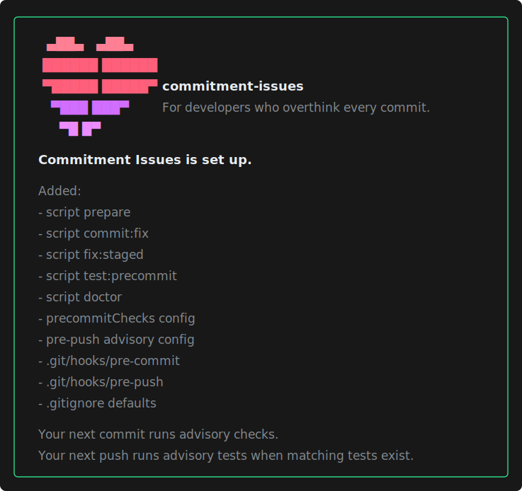
</p>

Shown only when `init` finishes wiring every configured hook along with the scripts, configuration, and gitignore defaults. The optional commit-msg hook is included only when enabled. Lists exactly what was added.

### Dry-run preview

<p>
  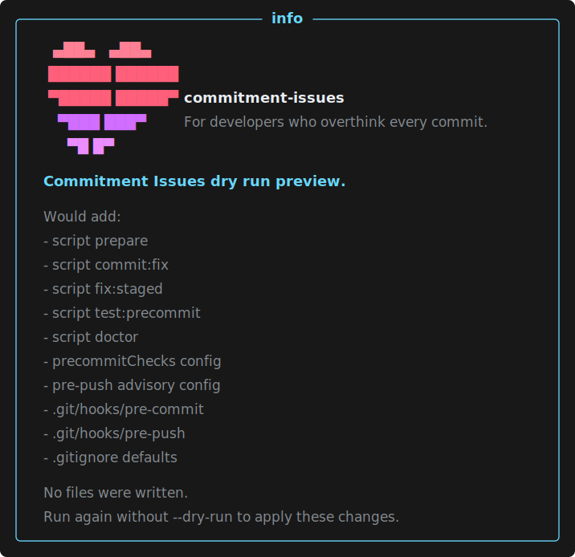
</p>

Shown for `init --dry-run`: when changes are pending, it shows the same change
list without writing anything and explains how to apply it. When setup is
already complete, it reports that nothing would change and does not instruct
the user to apply nonexistent changes.

### Already configured

<p>
  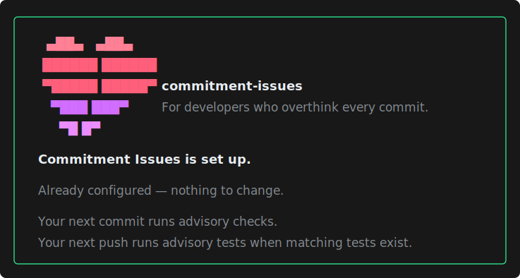
</p>

Shown when `init` is re-run, finds nothing to change, and verifies that every configured hook invokes `commitment-issues`. Init is safe to re-run at any time.

### No package.json

<p>
  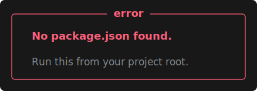
</p>

Shown when `init` (or interactive `doctor`) runs outside a project root.

### Invalid package.json

<p>
  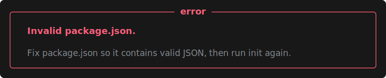
</p>

Shown when package.json cannot be parsed; fix the JSON and run `init` again.

### Invalid package.json structure

`Invalid package.json structure.` is shown when the JSON parses but its root,
`scripts`, or `precommitChecks` value is not an object. The message names the
invalid container, exits before any write, and tells the user to fix
`package.json` before rerunning `init`.

### Invalid .commitmentrc.json

`Invalid .commitmentrc.json.` is shown by `init` or `uninstall` when the
standalone file contains invalid JSON or its top-level value is not an object.
The command exits before changing package scripts, configuration, hooks, or
gitignore state.

### Invalid command arguments

`Unknown init option: <option>`, `Unknown uninstall option: <option>`, and
`Unknown doctor option: <option>` are shown when an argument is outside the
documented command contract. The command exits before changing project files or
hooks. Other CLI commands report the same invalid-argument decision as a plain
stderr line or, when `--json` was requested, a structured JSON diagnostic.
`The --integration option may be supplied only once.` is the corresponding
owner-selection cardinality error.

### Hook-manager owner selection

`Could not choose a hook-manager owner safely.` is shown by doctor when bare
`--integration` finds no owner or more than one. Init uses `No hook manager
could be identified.` or `Multiple hook managers were detected.` for the same
fail-before-write decision. An explicit `--integration=<manager>` resolves the
owner ambiguity without editing any owner. It does not override an unsafe,
duplicate, or unsupported selected configuration; those states still exit
before package, ignore, config, or hook changes.

### Project files unavailable

`Could not inspect .gitignore.` is shown when setup cannot safely read the
existing ignore path. The write-failure titles are:

- `Could not update package.json.`
- `Could not update the project files.`

These cover permission/preflight and unexpected write failures. The states stop
before hook installation or removal begins; rerunning `init` safely repairs any
project-file change left by an interrupted filesystem write.

### Unsafe project file

`Unsafe project file: <path>.` is shown when a mutable project path is a
symbolic link, a non-regular entry, or cannot be inspected safely. `init` and
`init --dry-run` check `package.json`, `.gitignore`, and `.commitmentrc.json`;
`uninstall` and `uninstall --dry-run` check the two JSON files they can modify.
The command names the reason and exits before changing project files or hooks.
Replace the path with a regular file inside the project before rerunning the
command.

### Hook wiring needs attention

<p>
  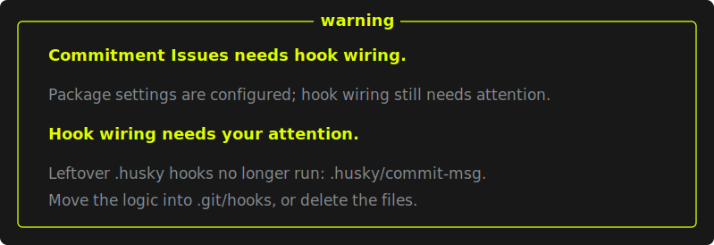
</p>

Included in the same warning summary when `init` cannot fully wire the hooks by itself: an existing native hook does not invoke `commitment-issues`, a foreign `core.hooksPath` is configured, user-authored `.husky` hooks are stranded by the husky-era migration, or the directory is not a git repository yet. Existing hooks are preserved, and missing integration lists the exact command to add. When the active hooks themselves cannot be verified, setup-complete commit/push claims are also withheld.

## Uninstall

### Uninstall preview

`Commitment Issues uninstall preview.` is shown for `uninstall --dry-run`. It
lists the exact generated scripts, configuration, and hook files that would be
removed without writing anything.

### Setup removed

`Commitment Issues setup was removed.` confirms the cleanup and prints the
detected package-manager command that removes the remaining dependency and
updates its lockfile.

### Manual cleanup still needed

<p>
  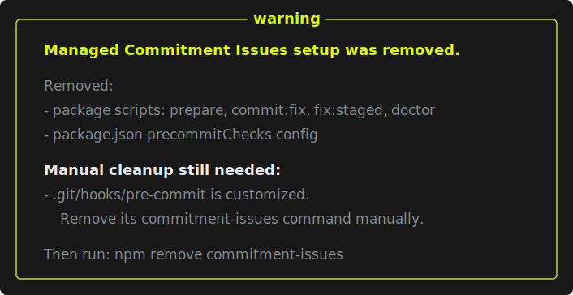
</p>

`Manual cleanup still needed:` is included in the same removal summary when a
hook or script invokes `commitment-issues` but has been customized, or when the
command cannot inspect local Git hooks. User-owned content is reported and
preserved instead of being edited heuristically.

## Pre-commit

### First-commit welcome

```text
╭───────────────────────── info ─────────────────────────╮
│                                                        │
│                          ,_,                           │
│                         (O,O)  <3                      │
│                         (   )                          │
│                         -"-"-                          │
│                                                        │
│   Commitment Issues is active here.                    │
│                                                        │
│   Commitment Issues checks changes before each         │
│   commit. Keep the hooks enabled, and tell us if       │
│   any guidance feels confusing.                        │
│                                                        │
│   Verify or repair the hooks anytime: npm run doctor   │
│                                                        │
╰────────────────────────────────────────────────────────╯
```

Shown once per clone as the final presentation for the first eligible clean or
informational human-readable pre-commit run. It is visible under the default
`hookOutput: "problems-only"` policy because it is onboarding, not a normal
check result. Warnings and errors take priority without consuming the welcome,
so one invocation never renders two boxes. The command follows the consuming
project's package manager. Its versioned Git-common-directory marker is shared
by linked worktrees; JSON mode and hook bypasses do not consume it. Set
`showWelcomeOnFirstCommit: false` to suppress both the message and marker.

### All checks passed

<p>
  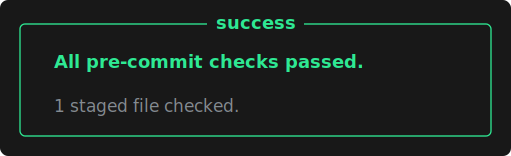
</p>

Shown when the pre-commit hook finds no advisory issues.

### Suggestions found

<p>
  
</p>

Shown when commit-time checks find advisory issues such as formatting drift, lint issues, or missing tests. The commit still continues, and `npm run commit:fix` is offered when amending the latest commit is safe.

When `scanDebugArtifacts` is enabled, every non-exempt added-line match joins
this same suggestions box as one “temporary debug artifacts staged” finding.
Its detail lines name each file, line, and curated rule. A failed or malformed
staged-diff inspection instead contributes one “Debug artifact scan
unavailable” advisory. Both states allow the commit and never create a second
box or prompt.

### Missing tests

<p>
  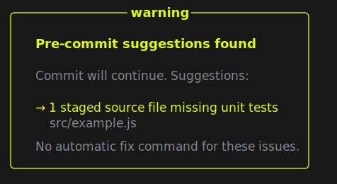
</p>

Shown when a staged source file has no nearby matching test and is not exempt.

### Manual lint issue

<p>
  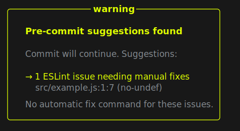
</p>

Shown when ESLint reports issues that cannot be fixed automatically.

### Auto-fixable lint issues

<p>
  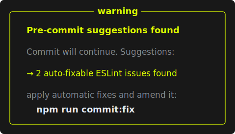
</p>

Shown when ESLint finds issues it can fix itself (such as `prefer-const`); `npm run commit:fix` applies them.

### Failing staged tests

<p>
  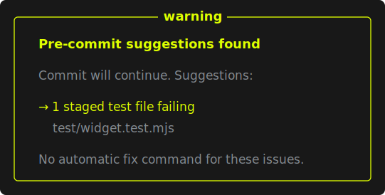
</p>

Shown when `runStagedTests` is enabled and a staged test file fails. The commit still continues.

### Tool timeout

<p>
  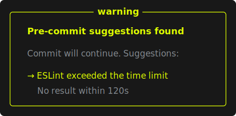
</p>

Shown when a spawned tool exceeds the configured timeout. Its attached process
group/tree is terminated before the hook continues.

### Tool crash

<p>
  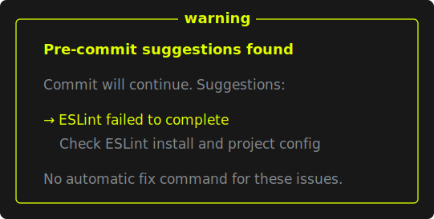
</p>

Shown when ESLint or Prettier exits with a crash (broken config, parse error) instead of reporting issues. A crash is never presented as auto-fixable.

### Tool unavailable

<p>
  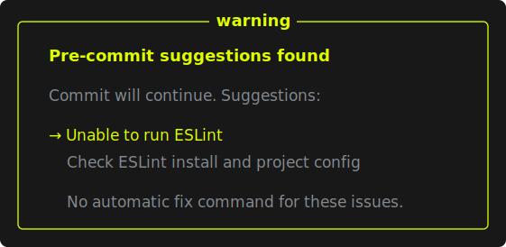
</p>

Shown when a project-local ESLint or Prettier install is missing, or a tool
cannot be spawned. The commit still continues. Missing peers include the
detected package manager's install command and never trigger an implicit `npx`
fallback.

### Amend blocked by other tracked changes

<p>
  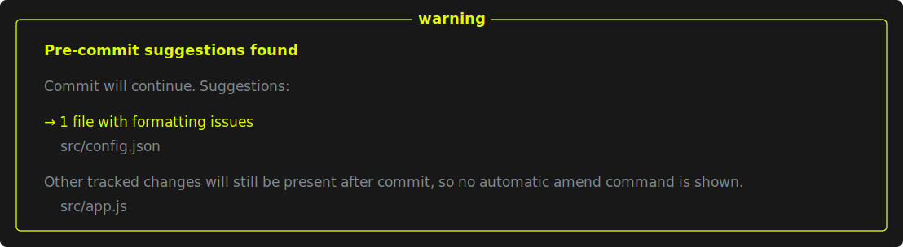
</p>

Shown when fixable issues exist but other tracked files have unstaged changes, so `npm run commit:fix` is withheld: an amend would not leave a clean worktree.

### Amend withheld: worktree not inspectable

<p>
  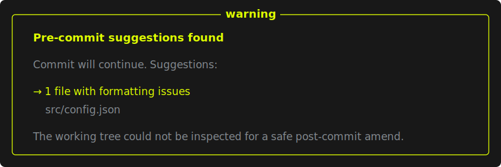
</p>

Shown when Git cannot report whether the worktree is clean; the amend recommendation is withheld rather than offered unverified.

### Fun tone

<p>
  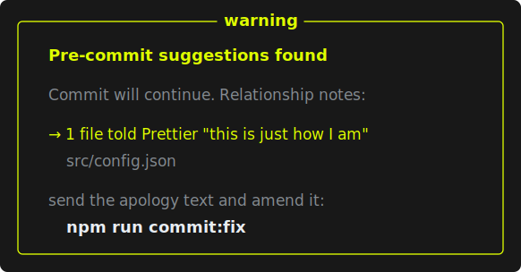
</p>

Shown when `precommitChecks.tone` is `"fun"`: every advisory state above keeps its structure but swaps in relationship-themed wording.

### Unknown config key warning

<p>
  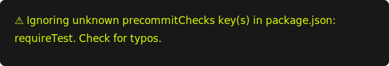
</p>

Shown as a diagnostic by hooks, `init`, and `doctor` when either configuration source contains an effective key the tool does not recognize — including typos like `requireTest` and nested paths such as `commitMessage.enable` that would otherwise silently fall back to default behavior. The diagnostic names the contributing source.

### Invalid config value warning

<p>
  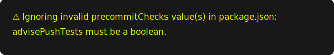
</p>

Shown as a diagnostic by hooks, `init`, and `doctor` when a recognized key in either configuration source has an invalid value — for example a string where a boolean is expected, a non-positive `timeoutMs`, or a non-boolean `commitMessage.enabled`. The invalid value is ignored in favor of the default; hooks remain advisory and continue.

### Malformed standalone config warning

`Ignoring .commitmentrc.json …` is printed as a one-line advisory when the
standalone file cannot be parsed or has a non-object root. The hooks continue
with `package.json` `precommitChecks` or built-in defaults instead.

### Unable to inspect staged files

<p>
  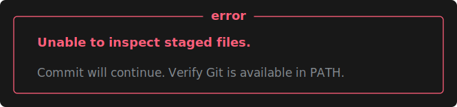
</p>

Shown when Git cannot list the staged files at all. True to the advisory philosophy, the commit still continues.

### No staged files

<p>
  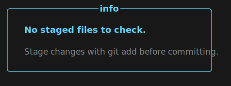
</p>

Shown when the pre-commit hook runs with no staged files.

### Deletion-only commit

<p>
  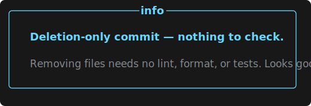
</p>

Shown when only deleted files are staged.

### No lintable or formattable files

<p>
  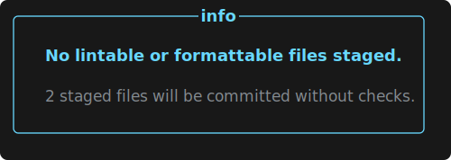
</p>

Shown when staged files are outside the JavaScript, TypeScript, and formatted-file patterns.

### No project files

<p>
  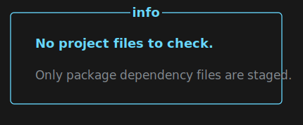
</p>

Shown when accidentally staged dependency files are ignored and no project files remain to check.

### Commit guard suggestions

<p>
  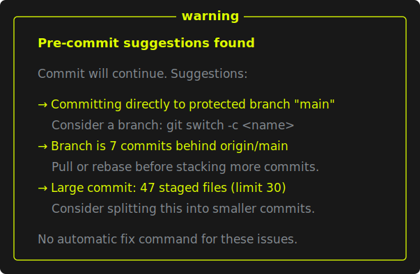
</p>

Shown when the advisory commit guards notice something about the commit itself. All guards join the same consolidated suggestions box as lint and test advisories, and the commit still continues. The individual guard states follow.

### Protected-branch commit

<p>
  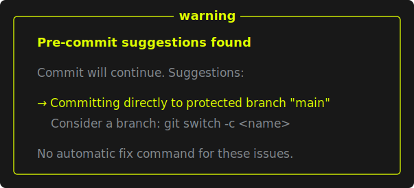
</p>

Shown when the current branch matches `protectedBranches` (default `["main", "master"]`, globs supported) and `blockProtectedBranches` is off. Set `protectedBranches: []` to disable for trunk-based repos.

### Behind upstream

<p>
  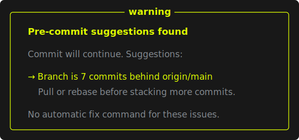
</p>

Shown when the branch is behind its upstream as of the last fetch. Disable with `adviseBehindUpstream: false`.

### Large commit

<p>
  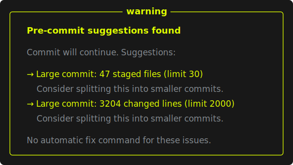
</p>

Shown when a commit stages more than `maxCommitFiles` files or changes more than `maxCommitLines` lines. Each exceeded limit prints its own suggestion; `0` disables either limit.

### Large staged file

<p>
  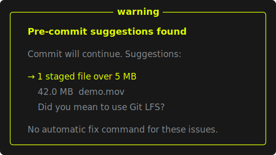
</p>

Shown when staged files exceed `maxFileSizeMb` (default 5). Each oversized file is listed with its size. `0` disables.

### Generated files staged

<p>
  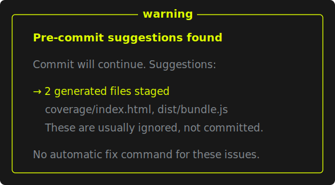
</p>

Shown when staged paths match `generatedPaths` (default: `dist`, `build`, `coverage`, `node_modules`, `.DS_Store`, `__pycache__` anywhere in the tree). Setting `generatedPaths` replaces the default list.

### Possible secrets staged

<p>
  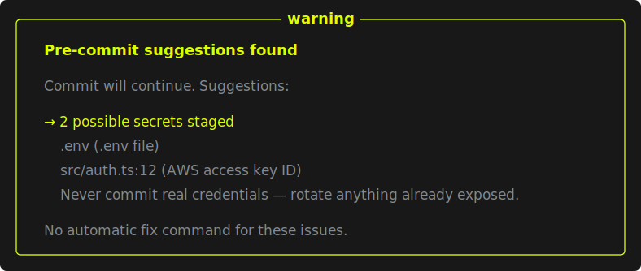
</p>

Shown when the staged diff adds a line matching a curated credential pattern (AWS keys, private-key headers, GitHub/Slack/npm/Stripe/Google tokens, URLs with embedded passwords) or a real dotenv file is staged (`.env.example`-style templates are ignored). Only added lines are scanned, so pre-existing strings and deletions never fire. Exempt fixture paths with `secretExempt`; disable with `scanSecrets: false`.

### Commit blocked: possible secret staged

<p>
  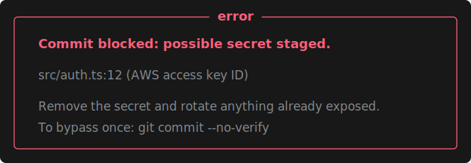
</p>

Shown only when `blockOnSecrets` is enabled and the scan found something. The commit is refused; `git commit --no-verify` bypasses it once. Rotate anything already exposed — a secret that reached a commit should be treated as leaked.

### Commit blocked: staged secret scan unavailable

`Commit blocked: staged secret scan unavailable.` is shown only when
`blockOnSecrets` is enabled and Git cannot launch, exits nonzero, or returns a
malformed staged patch. The commit is refused because possible secrets could
not be ruled out. This state is distinct from a detected secret in both human
and JSON output; retry after restoring Git/index access, or use
`git commit --no-verify` as an explicit one-time bypass. Without
`blockOnSecrets`, the same inspection failure is an advisory and the commit
continues.

### Commit blocked: protected branch

<p>
  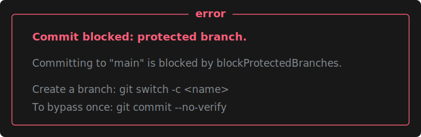
</p>

Shown only when `blockProtectedBranches` is enabled and the current branch matches `protectedBranches`. The commit is refused; `git commit --no-verify` bypasses it once.

## Commit message

These states appear only after `precommitChecks.commitMessage.enabled` is set
to `true`. A successful project-local commitlint run is silent.

### Commit message needs attention

`Commit message needs attention` reports commitlint output in advisory mode.
The commit continues and the consumer's rule name/detail remains visible.

### Commit blocked: commit message needs attention

`Commit blocked: commit message needs attention` is the same reported problem
with `commitMessage.blockOnFailure: true`. It exits non-zero and names
`git commit --no-verify` as the explicit one-time bypass.

### Commit-message check unavailable

`Commit-message check unavailable` covers a missing project-local commitlint
CLI or a local executable that could not start. The message states that no
`npx`, network, or global fallback was attempted and gives a package-manager
specific install command.

### Commitlint configuration not found

`Commitlint configuration not found` is shown for commitlint's missing-config
result or its strict-mode `empty-rules` diagnostic.
It asks the consumer to add its own rules and explicitly says no built-in
Conventional Commits policy was substituted.

### Unable to read the commit message

`Unable to read the commit message` means the hook received no readable regular
file. Message paths are passed as one quoted argument rather than interpreted
as shell fragments.

### Commitlint timed out

`Commitlint timed out` uses the shared `timeoutMs` ceiling. Like every failure
above it warns in advisory mode and blocks only after explicit enforcement.

Fun tone provides corresponding relationship-themed titles and body copy
without changing the result: `Commit message sent mixed signals`,
`Commitlint stood this commit up`, `Commitlint needs relationship rules`,
`The commit message went missing`, `Commitlint needed space`, and
`Commitlint left this commit on read`.

## Commit fix and staged fixes

### Latest commit amended

<p>
  
</p>

Shown after `npm run commit:fix` safely applies automatic fixes and amends the latest clean, unpushed commit.

### Latest commit amended with available fixes

<p>
  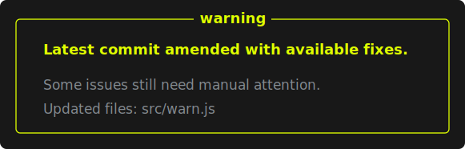
</p>

Shown when `commit:fix` amends what it can but some issues still need manual attention; it exits non-zero so the remaining work is not missed.

### Latest commit already clean

<p>
  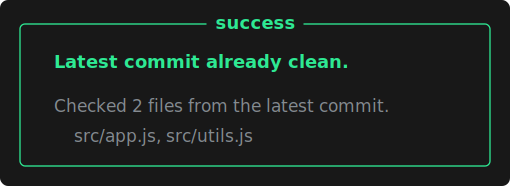
</p>

Shown when `commit:fix` checks the latest commit's files and finds nothing to change.

### No automatic fixes landed

<p>
  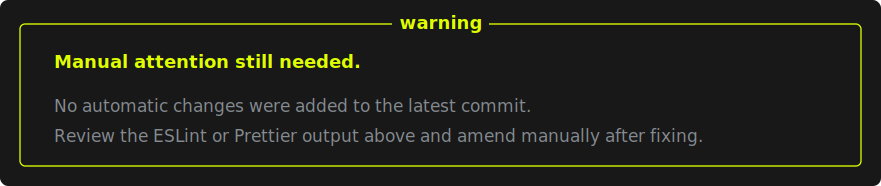
</p>

Shown when the fixers ran but produced no changes while issues remain (for example, a file Prettier cannot parse); fix manually, then amend.

### Fixes emptied the commit

<p>
  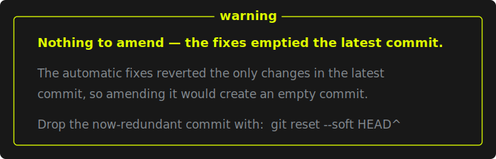
</p>

Shown when the automatic fixes reverted the only changes in the latest commit, so amending would create an empty commit; drop it with `git reset --soft HEAD^`.

### Already-pushed refusal

<p>
  
</p>

Shown when the latest commit exists on a remote branch. `commit:fix` never rewrites published history.

### Dirty worktree refusal

<p>
  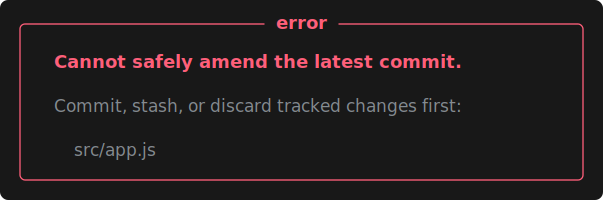
</p>

Shown when tracked files have uncommitted changes; commit, stash, or discard them before amending.

### Unpushed status unverifiable

<p>
  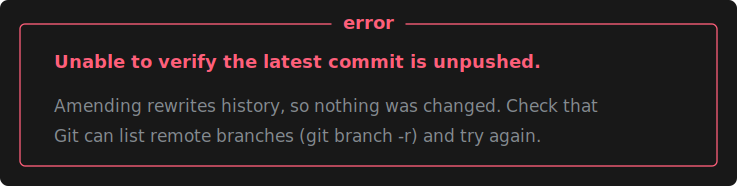
</p>

Shown when Git cannot list remote branches. The command fails closed rather than assume the commit is safe to rewrite.

### No commit to inspect

<p>
  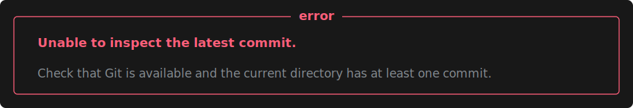
</p>

Shown when the repository has no commit yet (or HEAD cannot be resolved).

### No fixable files in the latest commit

<p>
  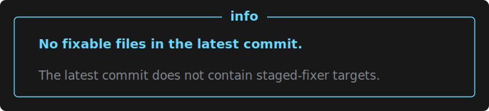
</p>

Shown when the latest commit contains no files the staged fixers handle.

### Fixes could not be staged or amended

<p>
  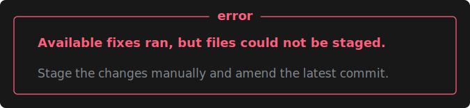
</p>

<p>
  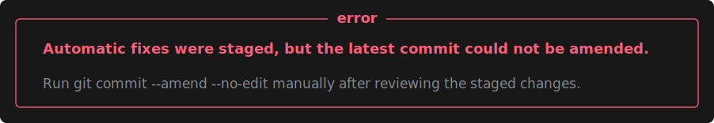
</p>

Shown when the fixes were produced but `git add` or `git commit --amend` failed; both boxes explain the manual recovery step.

### Git state could not be inspected

<p>
  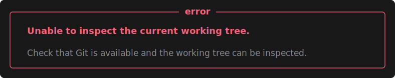
</p>

<p>
  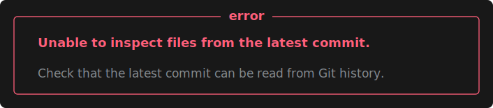
</p>

<p>
  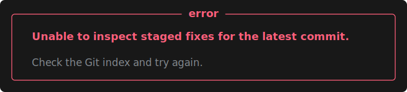
</p>

Shown when a Git probe fails partway through `commit:fix` (worktree, commit file list, or staged-fix inspection); the command stops instead of guessing.

### Staged fixes applied

<p>
  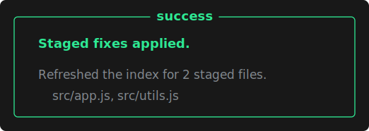
</p>

Shown when `npm run fix:staged` applies automatic fixes and refreshes the staged index.

### Staged files already clean

<p>
  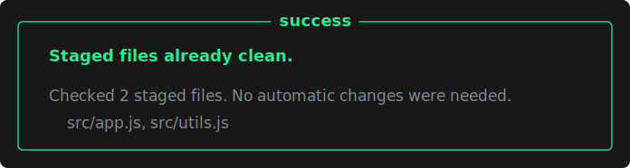
</p>

Shown when `fix:staged` runs but the staged files needed no automatic changes.

### Staged fixes need manual attention

<p>
  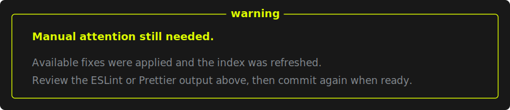
</p>

Shown when the available fixes were applied but non-fixable lint issues remain; it exits non-zero.

### No staged files to fix

<p>
  
</p>

Shown when nothing fixable is staged.

### Partially staged safety refusal

<p>
  
</p>

Shown when `npm run fix:staged` finds a file that has both staged and unstaged changes; resolve them before retrying.

### Staged file missing from the working tree

<p>
  
</p>

Shown when a staged file no longer exists on disk (for example, a broken symlink); restore or unstage it first.

### Staged or unstaged files could not be inspected

<p>
  
</p>

<p>
  
</p>

Shown when a Git probe fails before fixing starts; `fix:staged` stops rather than risk an unsafe index refresh.

### Fixed files could not be restaged

<p>
  
</p>

Shown when the fixers ran but the final `git add` failed: the fixes are safe in the working tree, and the command explains how to stage them manually.

## Pre-push

### Tests passed

<p>
  
</p>

Shown when push-time tests are enabled and the associated pushed-file tests pass.
When the same push targets a protected branch, both facts are consolidated:

<p>
  
</p>

### No tests to run

<p>
  
</p>

Shown when a push mode is enabled but none of the pushed files have associated tests.

### Checks disabled

<p>
  
</p>

Shown when the pre-push hook is run by hand and no push-test mode is configured.

### Advisory push failure

<p>
  
</p>

Shown when `advisePushTests` is enabled and pushed-file tests fail; the push is still allowed.
When the same push targets a protected branch, the final warning summarizes
both findings after the test-runner output:

<p>
  
</p>

### Blocking push failure

<p>
  
</p>

Shown when `blockPushOnTestFailure` is enabled and pushed-file tests fail; the push is blocked.

### Could not run tests (advisory)

<p>
  
</p>

Shown when `advisePushTests` is enabled but the test command itself fails to run (or times out); the push is allowed.

### Push blocked: could not run tests

<p>
  
</p>

Shown when `blockPushOnTestFailure` is enabled and the test command itself fails to run; the gate fails closed.

### Config conflict warning

<p>
  
</p>

Shown (as a one-line stderr warning, not a box) when both `blockPushOnTestFailure` and `advisePushTests` are set; blocking wins.

### Could not inspect pushed files (advisory)

<p>
  
</p>

Shown when Git cannot list the pushed files in advisory mode; a warning prints and the push is allowed.

### Push blocked: could not inspect pushed files

<p>
  
</p>

Shown when Git cannot list the pushed files in blocking mode; the gate fails closed rather than skipping the check.

### Pushing to a protected branch

<p>
  
</p>

Shown when the push updates a branch matching `protectedBranches` and
`blockProtectedBranches` is off. The push continues. If tests run, their result
is folded into this same final box instead of producing a second box.

### Push blocked: protected branch

<p>
  
</p>

Shown when `blockProtectedBranches` is enabled and the push targets a protected branch. The push is refused; `git push --no-verify` bypasses it once.

### Silent by design

A real `git push` with no push-test mode configured prints nothing at all — the hook stays out of the way. The [Checks disabled](#checks-disabled) box only appears when the hook is run by hand in a terminal.

## Doctor

### Configuration needs attention

`Configuration needs attention.` reports malformed standalone JSON, unknown
keys (including nested commit-message paths), or invalid values without
preventing hook diagnosis and repair. Interactive doctor output consolidates
these diagnostics, missing-tool notices, stranded-hook findings, and the final
hook-health result into one box.
`doctor --quiet` prints the same diagnostics as plain one-line warnings and
still exits successfully so an install is never broken.

### Hook-manager integration health

`<manager> integration is healthy.` confirms that every enabled manager entry
and its executable Git dispatcher are active; manager files were inspected but
not changed. `<manager> integration needs attention.` lists exact missing
snippets or the manager wrapper-install command and exits nonzero interactively.
Quiet mode emits one line and exits zero.

An older direct Commitment Issues entry is labelled for replacement with the
guarded dispatcher as the first substantive command. If the current
hook-dispatch entry is also present, the output instead asks the user to remove
only the older duplicate, retain and correctly position the current entry, and
does not print another snippet.

The health state requires an exact unconditional Commitment Issues entry:
duplicate Lefthook hook/command keys, duplicate pre-commit IDs, wrong or
repeated required fields, and any pre-commit `args` property on a Commitment
Issues entry are rejected. The complete selected document is schema-checked,
so an unsupported nested Lefthook job or unrelated pre-commit hook/root option
also requires manual review. Conditions and skip rules on supported unrelated
manager entries remain untouched.

`Multiple hook-manager owners were detected.` reports additional evidence when
the caller made an explicit choice. `lint-staged composition was detected.`
confirms that its separate task flow remains untouched.

### Some manager paths need manual review.

This advisory names linked, duplicate, non-regular, or otherwise uninspectable
candidates without treating them as healthy. Lefthook's JSON, JSONC, TOML,
local, extended/remote, advanced-YAML, and `LEFTHOOK_CONFIG`-overridden forms
also require manual review. A customized or newer Husky, Lefthook, or
pre-commit generated wrapper is preserved and reported rather than matched
approximately.

### Already healthy

<p>
  
</p>

Shown when `doctor` finds the hook wiring already correct.

### Repaired hooks

<p>
  
</p>

Shown when `doctor` recreates missing `.git/hooks` files or retires dead husky-era wiring (a pre-3.0 `core.hooksPath` left behind after the husky package was removed).

### Hook not wired

<p>
  
</p>

Shown when a custom hook exists but never invokes `commitment-issues`; `doctor` reports it and leaves the hook untouched.

### Hook inactive

`A git hook is inactive.` is shown on POSIX when a custom hook contains the
expected command but the file is not executable. `doctor` leaves the file and
its mode untouched and prints the exact `chmod +x` command to run.

### Missing peer tools

<p>
  
</p>

Shown when eslint or prettier cannot be resolved from the project's
`node_modules`. Advisory only: missing tools never fail an otherwise-healthy
repo, and `doctor` states that hooks do not download them through `npx`.

### Commit-message linting is not ready

`Commit-message linting is not ready.` appears when the integration is enabled
but `node_modules/.bin/commitlint` is absent. It suggests installing
`@commitlint/cli` locally and adding a consumer-owned config; it never downloads
anything or makes `doctor --quiet` fail an install.

### Foreign core.hooksPath

<p>
  
</p>

Shown when `core.hooksPath` points at a directory this tool does not manage (another hook manager or a custom hooks dir) whose hooks never invoke `commitment-issues`. The configuration is never changed; the box lists the commands to add there (or how to unset it). When those hooks already invoke the tool, doctor reports healthy instead. Husky-era wiring gets the same respect while the husky package is still installed — doctor nudges toward `init` for the migration instead of rewiring automatically.

### Leftover .husky hooks

<p>
  
</p>

Shown when user-authored hooks are stranded in `.husky/` after the husky-era wiring is retired. Advisory only — the files are never deleted.

### Legacy Husky path needs manual review

`The legacy .husky path needs manual review.` is included in interactive
`doctor` output when `.husky` is a symbolic link, a non-directory entry, or
cannot be read safely. `init` and `uninstall` report the same preservation
decision in their existing summaries. No command follows or removes the path;
the user must inspect it manually. Quiet doctor prints the decision as a plain
warning and still exits successfully so dependency installation is not broken.

### Not a git working tree

<p>
  
</p>

Shown when interactive `doctor` runs outside a Git worktree or inside a bare
repository. Bare repositories are called out explicitly because local commit
and push hooks do not run there. (`doctor --quiet` exits silently instead, so
installs never break.) Running without a package.json shows the same
[No package.json](#no-packagejson) box as `init`.

### Repair failed

<p>
  
</p>

<p>
  
</p>

Shown when a repair step fails (for example, the husky-era `core.hooksPath` cannot be unset or a hook file cannot be written) or the wiring still looks broken afterward; interactive mode exits non-zero, `--quiet` warns in one line and still exits 0. `Could not determine core.hooksPath.` identifies a failed Git configuration probe specifically. `Could not locate the configured git hooks directory.` means Git returned a configured value but could not resolve its effective directory. In both cases, no hook is written or reported healthy while the active hook location is unknown.

### Quiet mode one-liners

<p>
  
</p>

`doctor --quiet` (the generated or composed `prepare` repair command) never prints boxes: it stays silent when healthy and prints a single line for each configuration warning or when it repairs something, finds missing tools, spots an unwired hook, or cannot complete a repair. It always exits 0 so an install can never break.

## Adding more examples

Add an SVG for each documented message state so the gallery stays visually consistent. Keep the README focused on the core user journey and use this page for the complete state catalog.
